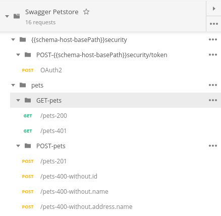
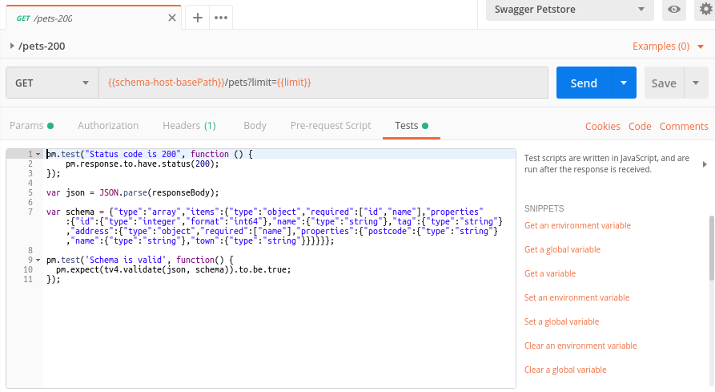
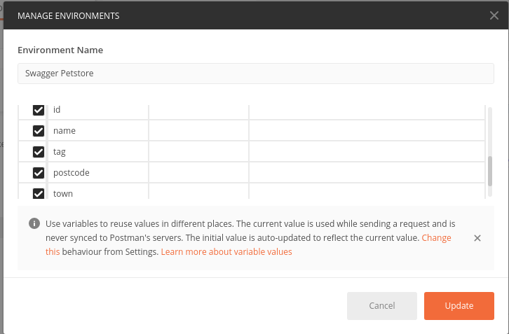
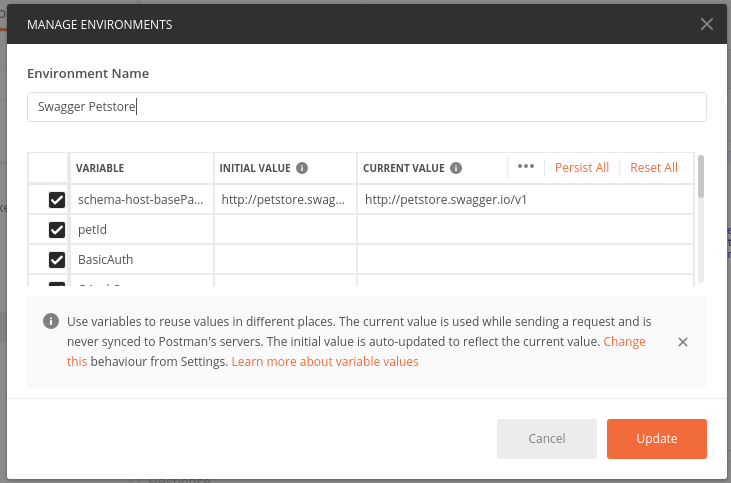
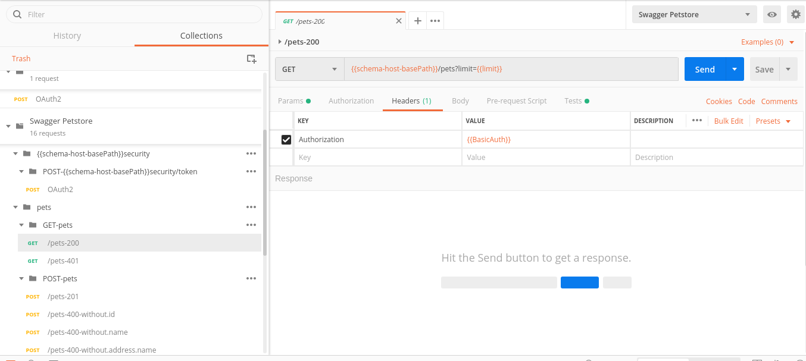
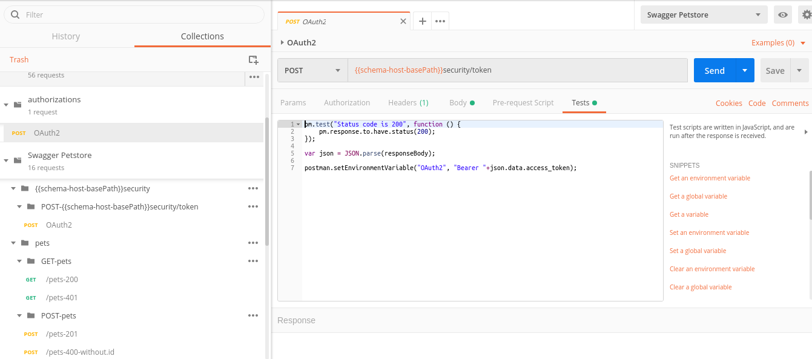
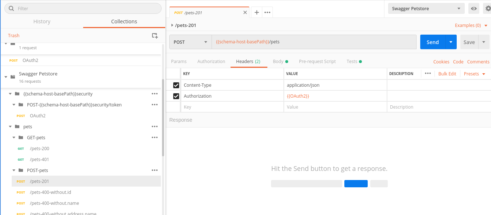
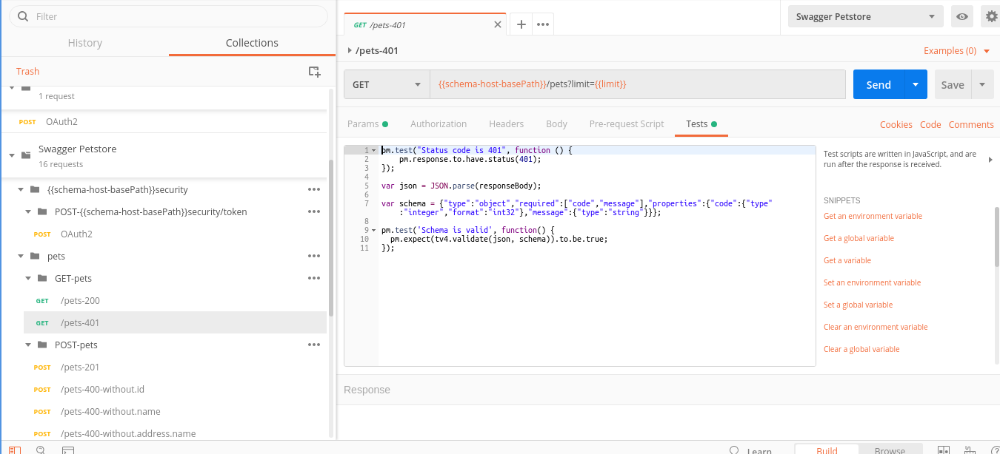
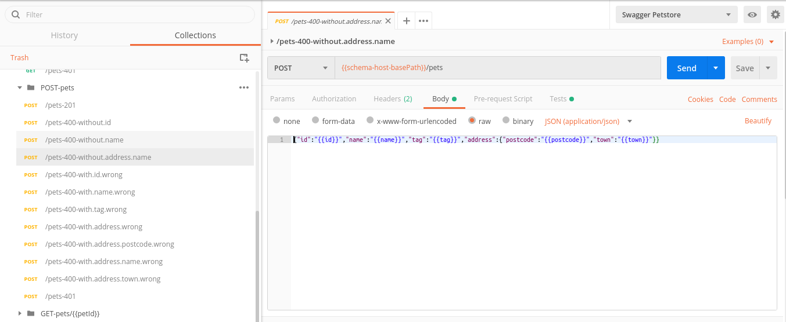
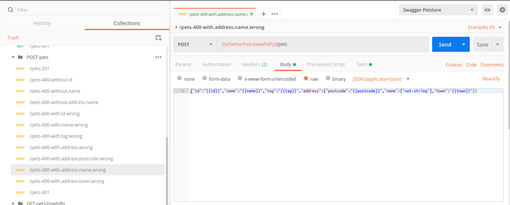

# swagger2postman

swagger2postman genera una colección y un entorno Postman a partir de un archivo de definición OpenApi v. 2.0 (AKA swagger). Dicha colección incluye tests para respuestas 2xx, 400, 401 y 404.

En todos los casos se comprueba el _status_ HTTP y se verifica que la respuesta cumple con el esquema definido en el swagger. En las respuestas con _status_ 400 se comprueban los campos obligatorios de la petición, tanto su tipo y formato como su existencia. Las respuestas con _status_ 401 se prueban eliminando la cabecera _Authorization_.

El fichero de entorno generado contiene todas las variables necesarias en los cuerpos y las URLs. Estas variables se usan en la colección Postman generada.

Para las llamadas a endpoints protegidos por esquemas de seguridad HTTP basic o APIKey se generan las variables de entorno que contienen los identificadores.

Si se usa una definición de seguridad de tipo Oauth 2 se debe pasar la ruta a un archivo que debe contener una colección postman con las peticiones necesarias para obtener los tokens.
El nombre de cada petición será el que se especifique en _securityDefinition_ y se creará una variable de entorno con el mismo nombre que contendrá dicho token . Después se añadirá la petición a la colección generada, así como la variable con el token al entorno generado.

El _status_ 401 se prueba no enviando el token de acceso.

El _status_ 400 se prueba no enviando parámetros obligatorios.

También puede probarse enviando parámetros de tipo erróneo (distinto al definido en el swagger).

## Archivo de configuración

Es posible configurar la ejecución de la herramienta para que genere las colecciones y entornos que se deseen, eligiendo el nombre de los archivos, la ubicación dónde se dejarán los resultados, el tipo de peticiones que se pueden realizar, etc. Dicha configuración se establece de forma individualizada para cada colección y entorno. Puede consultarse la definición y ejemplos de dicho archivo de configuración en el siguiente documento:
[Archivo de configuración swagger2postman](./docs/MD-swagger2postman-Archivo_de_configuracion.pdf)

En la estructura de archivos se incluye un archivo de configuración que puede tomarse como ejemplo.

## Configuración del entorno de trabajo

Para poder ejecutar la herramienta es necesario tener instalado node.js y su gestor de paquetes, npm.
Para instalar ambas herramientas en local podemos descargar el instalador preconfigurado que proporciona el fabricante:
[https://nodejs.org/es/download/](https://nodejs.org/es/download/)

## Ejecución de la herramienta

Los argumentos de ejecución de la herramienta son dos, ambos obligatorios:

* Archivo con la definición de la API acorde a la especificación OpenApi 2.0 en formato yaml.
* Archivo JSON de configuración.

En ambos casos se especificará la ruta local a ambos archivos.

Puede probarse la herramienta con el swagger de ejemplo y la colección de autorizaciones proporcionada. Se ejecutarán desde el directorio en el que se ubica la estructura de ficheros entregada los siguientes comandos:

 `npm install`

 `node index.js --file example/swagger_provincias.yml  --configuration example/o2p_config_file.json`

Tras la ejecución del comando se generarán los siguientes archivos:

* test_results/Provincias_API_TestSuite_DEV.postman_collection.json: Colección para pruebas de desarrollo sin peticiones de autorización.
* test_results/Provincias_API_TestSuite_VAL.postman_collection.json: Colección para pruebas en validación con todas las peticiones necesarias.
* test_results/Provincias_API_TestSuite_PROD.postman_collection.json: Colección para pruebas en producción sin peticiones de escritura de datos.
* test_results/Provincias_API_TestSuite_DEV.postman_environment.json: Entorno para la colección de desarrollo.
* test_results/Provincias_API_TestSuite_VAL.postman_environment.json: Entorno para la colección de validación.
* test_results/Provincias_API_TestSuite_PROD.postman_environment.json: Entorno para la colección de producción.
