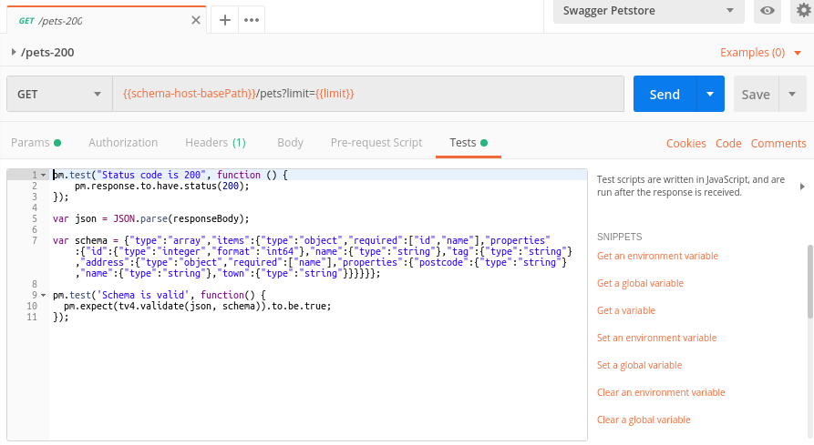
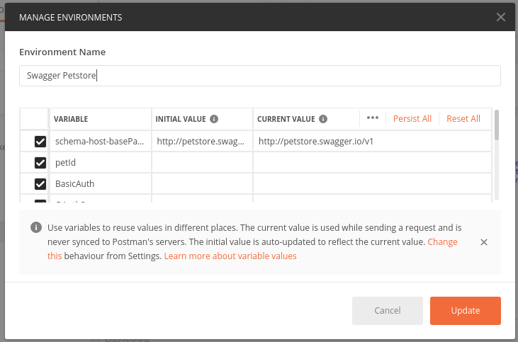
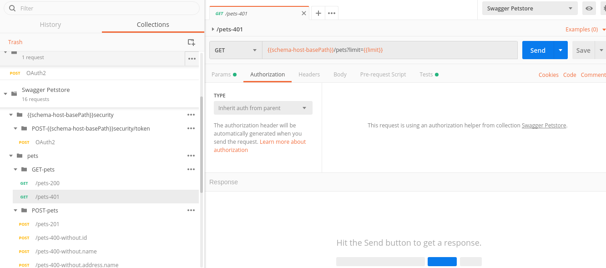
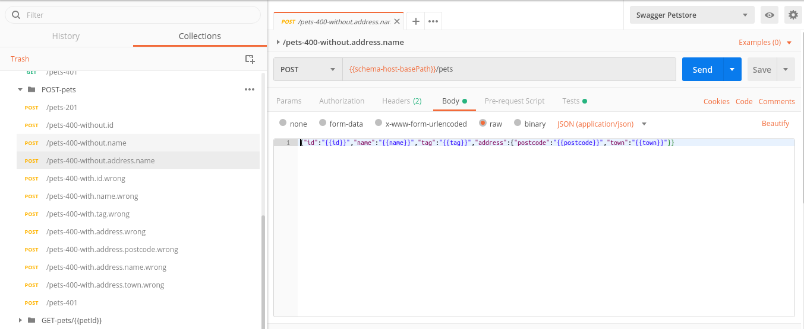

# Start Guide

Guide to start with the tool

If you import the autogenerated file in postman, you will see the following structure:

In all cases the status is checked and it is verified that the scheme of the output corresponds to the defined. In the 400 the wrong types and the obligatory fields are tested. To check the 401, the authorization header is not sent.

swagger2postman also generates a file of type environment with all the variables of both the bodies and the paths. These variables are used by the collection of postman generated to compose their bodies and their paths.

In the endpoints protected by basic token or by apikey an environment variable will be generated for these tokens.

if you use the securityDefinition of type oauth2 you will need to pass as an argument another collection that includes the requests to get the token. The name of each request will be the name of the securityDefinition and the token with the same name will be set in the test part. After that request will be copied to the result collection to get the token.

401 will be tested not sending the token.

400 will be tested not sending required parameters.

400 will be tested sending parameters with other types.

