# swagger2postman

swagger2postman converts a yaml (swagger 2.0) to a postman collection. This collection includes tests for the 2xx, 400 and 401.

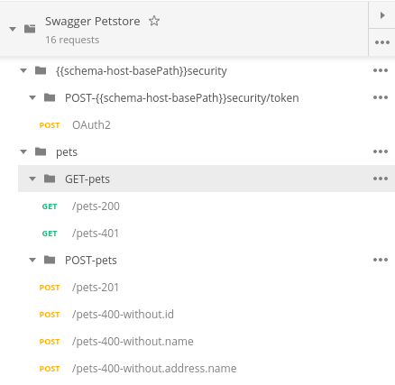

In all cases the status is checked and it is verified that the scheme of the output corresponds to the defined. In the 400 the wrong types and the obligatory fields are tested. To check the 401, the authorization header is not sent.

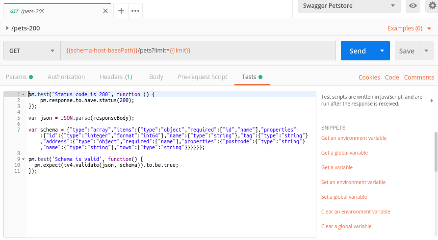

swagger2postman also generates a file of type environment with all the variables of both the bodies and the paths. These variables are used by the collection of postman generated to compose their bodies and their paths.

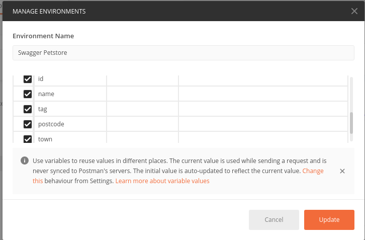

In the endpoints protected by basic token or by apikey an environment variable will be generated for these tokens.

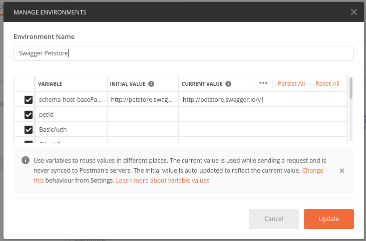

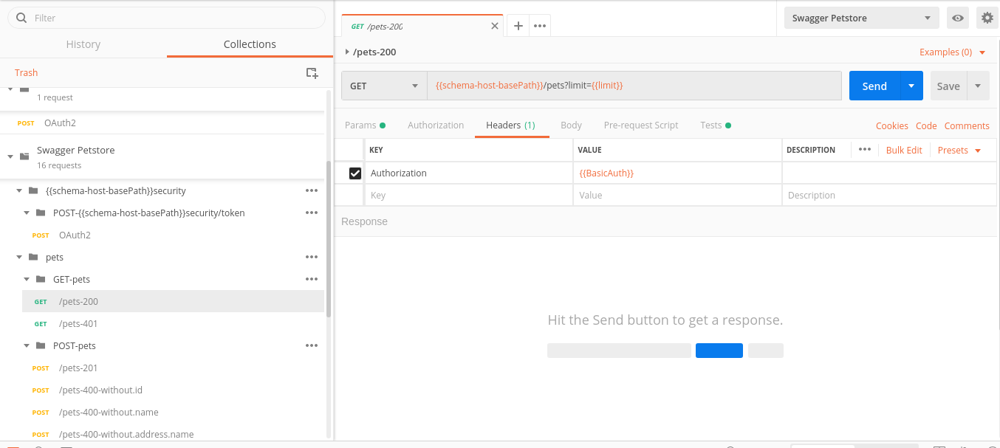

if you use the securityDefinition of type oauth2 you will need to pass as an argument another collection that includes the requests to get the token. The name of each request will be the name of the securityDefinition and the token with the same name will be set in the test part. After that request will be copied to the result collection to get the token.

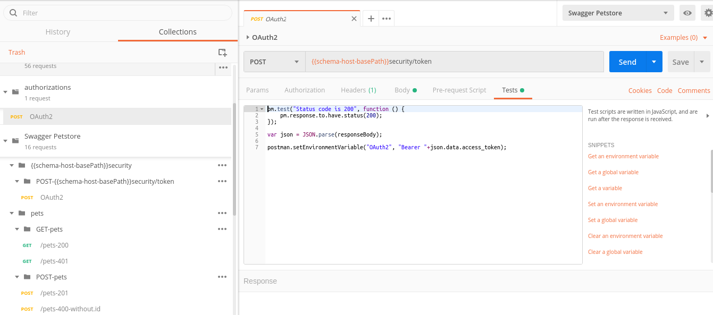

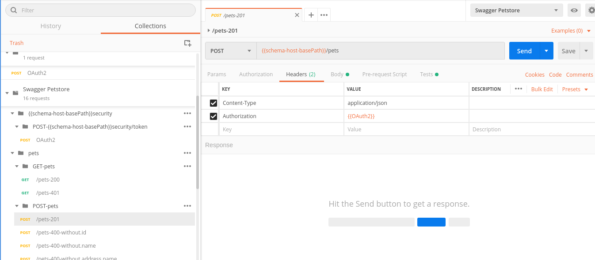

401 will be tested not sending the token.

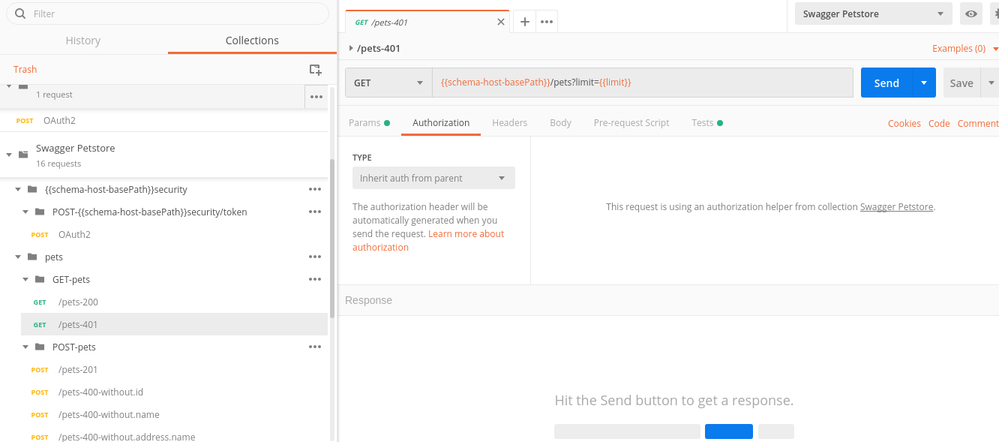

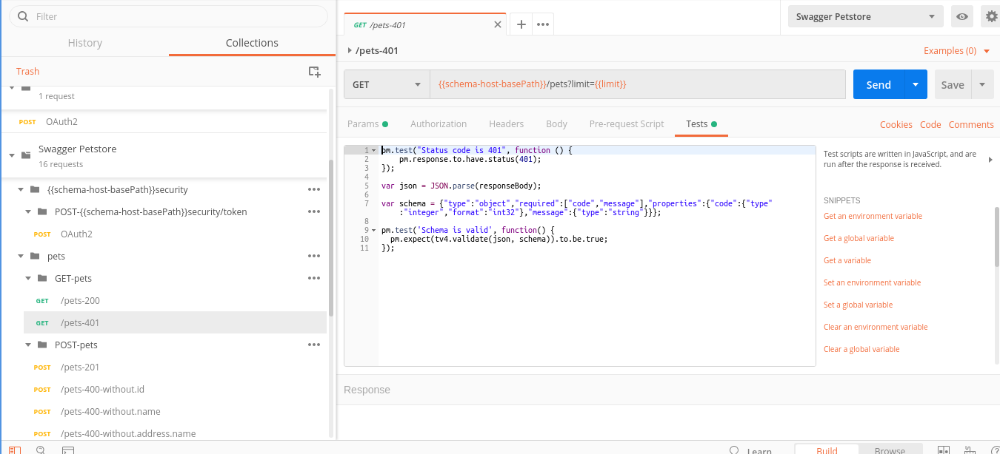

400 will be tested not sending required parameters.

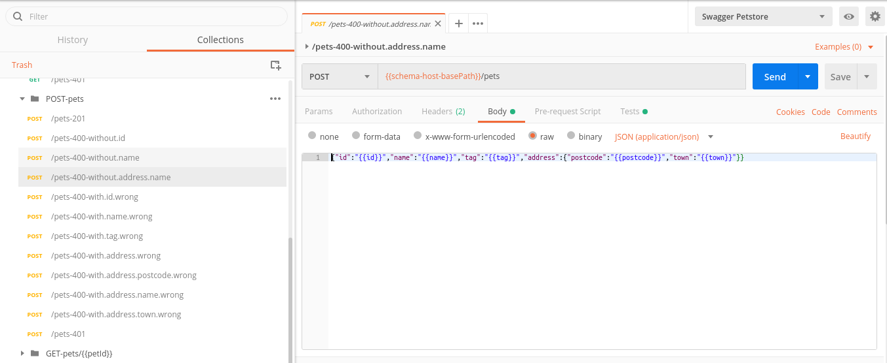

400 will be tested sending parameters with other types.

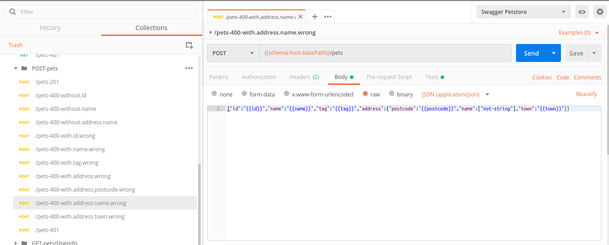

## Configuration file

Collections and environments to generate can be configured using a JSON configuration file. Collection and environment name can be specified, as well as the target folder for resulting files, the authorizations collection to be used and some other characteristics. This configuration file has an specification and examples that can be read on the following document:  
[Configuration file swagger2postman](./docs/MD-swagger2postman-Archivo_de_configuracion.pdf). This document is only available in spanish by now. it will be soon translated to english.

an example configuration file is included in file structure.

## Workspace configuration

Node.js and npm package manager are required to run the tool. Its adviced to use preconfigured installation tools provided by the manufacturer:
[https://nodejs.org/es/download/](https://nodejs.org/es/download/)

## Tool run

to run the tool we should provide two arguments, both are required:

* --file: API definition file. it should be an OpenApi 2.0 specification compliant file on yaml format.
* --configuration: JSON configuration file.

Local path to files must be specified.

Tool can be run using example files provided. Run the following commands from index.js containing folder.:

 `npm install`

 `node index.js --file example/swagger_provincia.yml  --configuration example/s2p_config_file.json`

After execution these will be the resulting files:

* test_results/Provincias_API_TestSuite_DEV.postman_collection.json: Development test suite with no authorization requests.
* test_results/Provincias_API_TestSuite_VAL.postman_collection.json: Validation test suite including all requests.
* test_results/Provincias_API_TestSuite_PROD.postman_collection.json: Production test suite with no data writing or deleting requests.
* test_results/Provincias_API_TestSuite_DEV.postman_environment.json: Development test suite environment.
* test_results/Provincias_API_TestSuite_VAL.postman_environment.json: Validation test suite environment.
* test_results/Provincias_API_TestSuite_PROD.postman_environment.json: Production test suite environment.
